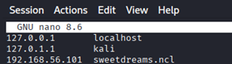
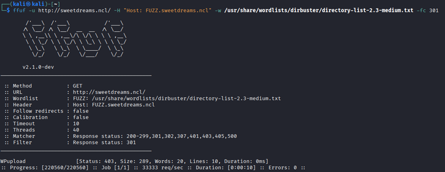
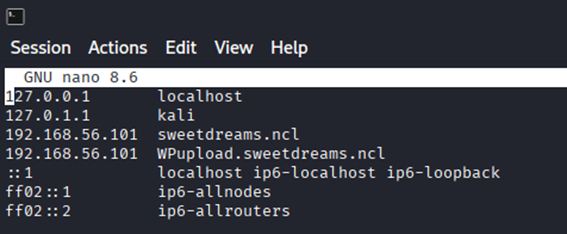
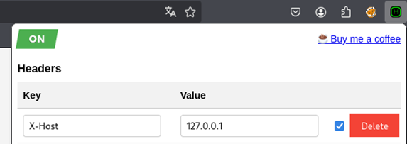
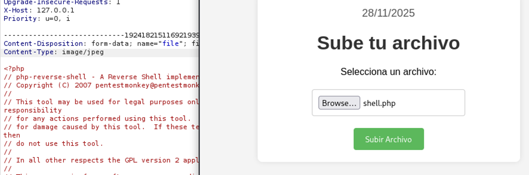
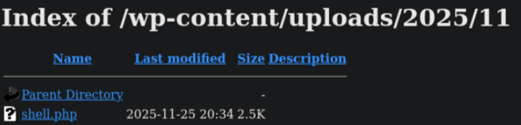
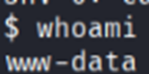
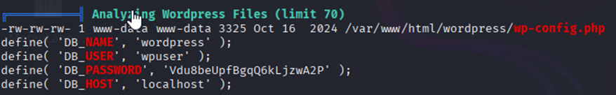

#### Técnicas usadas

1. IP discover
2. Fuzzing de subdominios
3. Bypass 403
4. File upload
5. File upload bypass - Content Type

#### Hacking Web

Hacemos un netdiscover para averiguar la IP de la maquina vulnerable.


Vemos que redirige a un dominio por lo tanto modificamos el fichero host.



Hacemos un listado de subdominios y vemos que existe uno



Lo añadimos también en el fichero host



Con un bypass403 descubrimos que poniendo este header nos deja a entrar a la pagina



Nos deja subir un archivo mediante un bypass en el Content Type



Vamos al directorio donde se guardan los archivos de WordPress y vemos que esta nuestra reverse shell.



Nos ponemos en modo escucha, y vemos que ya podemos ejecutar comandos



#### Escalada de privilegios

Encontré esto pero resulto ser un rabbit hole



Siguiendo el linpeas encontré un puerto en uso que era el 8888, resulto que hay que hacer un remote port forwarding, hay que habilitar en la kali el ssh y luego poner este comando.

```bash
ssh -N -R 127.0.0.1:8888:127.0.0.1:8888 ivan@10.104.0.21
```

Reiniciamos y podemos entrar al login de un inventory management system.

NO PUDE HACER MAS PORQUE DESPUES DEL DESCANSO MI MÁQUINA DEJO DE FUNCIONAR POR ARTE DE MAGIA EN MODO BRIDGE Y ME PUSE HACER UNA MÁQUINA DE PG, INTENTARE EL FIN DE SEMANA SEGUIR HACIENDOLA.


